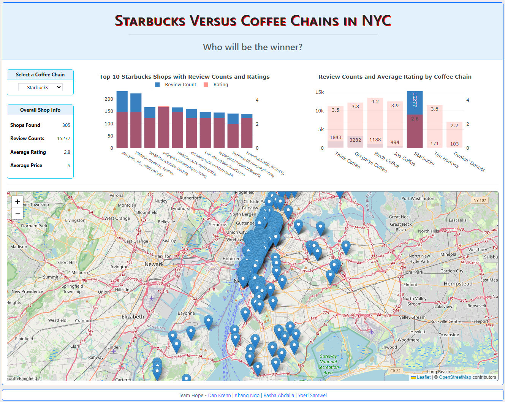

## NYC Coffee Shop Comparison
Project 3



## Project Goals:
The goal of the present project is to generate a website that allows for the comparison of coffee shop chains in New York City. Specifically, we aim to examine the price point and ratings of 5 coffee shop chains located around NYC and aim to discover how they differ from corporate giant Starbucks and/or Dunkin' Donuts on those metrics.

Our specific data questions include:
1. Is there a connection between price point and ratings of the 5 largest coffee shop chains in New York City?
2. How do the other larger chains compare to Starbucks and/or Dunkin' Donuts in terms of rating and price point?

### Running The App:
Using <code>Git Bash</code> or any other terminal navigate to where the repo is cloned. Once inside the repo main folder, type <code>python main.py</code> to start the app.

<b>Note:</b> Before starting the app, make sure to complete the prerequisites below.

### Pre-requisites:
1) Run the following command from within your terminal to install the required Python libraries used for this app and data extraction.
```
pip install requirements.txt
```  
2) Copy and paste your API Key from <a href="https://www.yelp.com/developers/v3/manage_app">Yelp API</a> into the <code>api_key.py</code> file located in <code>website/jupyter/</code>. This is needed if you need to re-run the data extraction in the <code>etl.jpynb</code>.
   Refer to <a href="https://docs.developer.yelp.com/docs/fusion-intro">Yelp Fusion API</a> documentation on how to set up the API key.
```
api_key = '<API KEY>'
``` 

## Data Sources Files:
This data was collected from the Yelp API. Specifically, we examined the following 5 coffee chains:
- Starbucks
- Dunkin' Donuts
- Tim Hortons
- Think Coffee
- Birch Coffee
- Joe Coffee
- Gregory's Coffee

## Data Extraction & Cleaning: 
TBD

## Products Developed:
The following products were developed for the web page:
<u>From Home page</u>:
- A map of coffee shops for the 5 chains with the ability to filter on chain name, price point, 
and review counts. 
- A bar Chart for price point comparisons among 5 coffee chains.
- A bar Chart for average rating comparisons among 5 coffee chains.
<u>From Map View page</u>:
- A full-size map showing all coffee shops with each one being toggleable.

## Findings:
An examination of the map reveals INSERT DESCRIPTION.

An examination of the price point bar chart reveals INSERT DESCRIPTION.

An examination of the rating bar chart reveals INSERT DESCRIPTION.

To specifically address our first question, DESCRIBE HOW CHARTS SHOW SIMILAR OR DIFFERENT TRENDS.

To examine the second question, we examined how price point and ratings differ between starbucks and other chains. Our graph interpretations suggest that INSERT FINDINGS.

## References:
- https://www.youtube.com/watch?v=dam0GPOAvVI - for general guidance on building a website using Flask
- https://github.com/Yelp/yelp-fusion/blob/master/fusion/python/sample.py - for examples using API calling from Yelp
- https://plotly.com/javascript/ - for chartings
- https://leafletjs.com/ - for mapping
