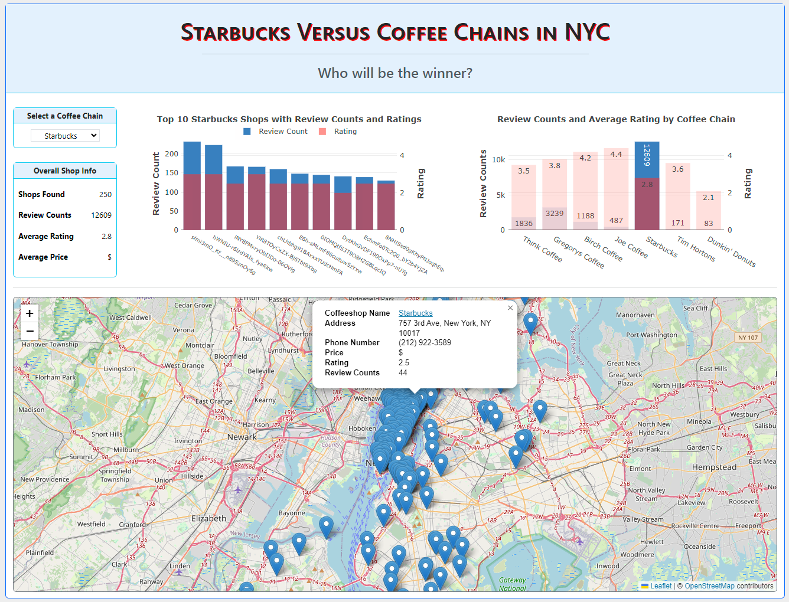

## NYC Coffee Shops Comparison

## Project Goals:
The goal of the present project is to generate a website that allows for the comparison of coffee shop chains in New York City. Specifically, we aim to examine the price point and ratings of 4 coffee shop chains located around NYC and aim to discover how they differ from corporate giant Starbucks, Dunkin' Donuts, and Tim Hortons on those metrics.

Our specific data questions include:
1. Is there a connection between price points and ratings of the 7 largest coffee shop chains in New York City?
2. How do the other larger chains compare to Starbucks, Dunkin' Donuts, and Tim Hortons in terms of rating and price point?

### Running The App:
1) Using <code>Git Bash</code> or any other terminal navigate to where the repo is cloned. Once inside the repo main folder, type the following command to start the app.
```
python main.py
```  
3) Copy the HTTP link generated by Flask and paste it into your web browser.

<b>Note:</b> Before starting the app, make sure to complete the prerequisites below.

### Pre-requisites:
1) Run the following command from within your terminal to install the required Python libraries used for this app and data extraction.
```
pip install -r requirements.txt
```  
2) Copy and paste your API Key from <a href="https://www.yelp.com/developers/v3/manage_app">Yelp API</a> into the <code>api_key.py</code> file located in <code>website/jupyter/</code>. This is needed if you need to re-run the data extraction in the <code>etl.jpynb</code>.
   Refer to <a href="https://docs.developer.yelp.com/docs/fusion-intro">Yelp Fusion API</a> documentation on how to set up the API key.
```
api_key = '<API KEY>'
``` 

## Data Sources Files:
This data was collected from the Yelp API. Specifically, we examined the following 7 coffee chains:
- Starbucks
- Dunkin' Donuts
- Tim Hortons
- Think Coffee
- Birch Coffee
- Joe Coffee
- Gregory's Coffee

These data sources are stored in <code>SQLite database</code> (the choice of the database used for this project) for data pulling and presenting in the main app. However, the app can also be run by using the <code>JSON</code> file as well simply by uncommenting the option 1 under the <code>data.js</code>. Make sure to comment out the other option when not in use.
```
// Select one option below only by commenting out the one not using
// Option 1 - Using the json file
// const data = "../dataset/merged.json";

// Option 2 - Using the db file
const data = "/db-query";
```

<b>Notes:</b> Even though the dataset for this app only uses the coffee chain shops listed above, you can however add more shops or remove them by adjusting the <code>coffee_chains</code> object variable in the <code>etl.jpynb</code> file. This will update the database along with the <code>json</code> and <code>csv</code> files that will reflect in the app when run.

## Extract, Transform, and Load (ETL) Process: 
- We developed a function to extract data for coffee shops using offset of 200 and maximum radius of 40,000 (~25 miles) while taking into consideration the Yelp API limit of 50 restaurants per call.
- In this function, we pulled all the data in JSON format and transformed the data with the output of the function being a pandas data frame.
- We placed the restaurants we needed to extract in a list.
- After which we looped through this list allowing us to make 200 calls per restaurant. We then appended these restaurants into one final dataset.
- This was then pushed to the SQL Lite server using SQL Alchemy.

## Products Developed:
The following products were developed for the web page:

- From the Home page 
   - A map of coffee shops for the selected shop with popup markers showing the shop name, address, phone number, and price point.
   - A bar Chart showing the top 10 shops with review counts and ratings for the selected shop.
   - A bar Chart for average rating and total review counts comparisons among all coffee chains within the dataset.
   - A table showing the overall information for selected coffee chain shops.
  
- From Map View page 
   - A full-size map showing all coffee shops with each one being toggleable and having markers showing shop name, address, phone number, price point, and rating.
   
     
     
- From SQLite Viewer page:
   - Opens up a new page/tab showing the extracted data from the ETL process into the SQLite database.

- From JSON Viewer page:
   - Opens up a new page/tab showing the extracted data from the ETL process exported into a JSON file format.

## Findings:

An examination of the map not surprisingly reveals that Starbucks is overwhelmingly the most commonly rated coffee shop. The next three most common are Gregory's Coffee, Think Coffee, and Birch Coffee. There were notably fewer ratings for Dunkin, Tim Hortons, and Joe Coffee. Surprisingly, Dunkin Donuts and Tim Hortons, which were added as comparisons due to their brand size and visability nationwide, showed very minimal data. 

An examination of the price point data reveals that Gregory's Coffee and Think Coffee were rated as more expensive than the other coffee chains.

An examination of the rating bar chart reveals provided some interesting findings. Of the smaller chains, Joe Coffee was rated highest, and Think Coffee was rated lowest. Looking at the larger chains,  Tim Hortons had the highest rating, and Dunkin Donuts had the lowest. Generally speaking, the smaller chains outperformed the larger chains in terms of ratings. Only Think Cofee had a rating below a major chain. (Tim Hortons was rated 3.6, and Think Coffee was rated 3.5.) All the other small chains had average ratings above the major chains. 

To specifically address our first question, we compared the chains that were rated highly to the chains that showed the highest perceived price points. 
There is no obvious relationship between price point perceptions and ratings if you look across all of the chains. However, an examination of just the smaller chains did show an interesting pattern. Think Coffee and Gregory's Coffee, which both had a price point of $$, were the two lowest rated smaller coffee chains. However, this pattern did not continue if you included Starbucks and other larger chains. The explanation of why this trend exists needs more information. One plausible explanation is that people who had dissatisfying experiences left feeling that the coffee was overrated, leading to them pricing the coffee subjectively higher (satisfaction drove perceptions of price). An alternative explanation is that the coffee was legitimately more expensive, which led to a less satisfying experience (i.e., coffee price drove ratings). There are also some limitations to this trend. First, if you exclude major coffee shops, there were only 4 usable coffee shop brands to compare. That provides enough data to loosely interpret a graph. But there's insufficient data to tell if there's a statistically significant relationship between price and ratings.

To examine the second question, we examined how price points and ratings differ between Starbucks and other chains. There's some limitation here given that none of the chains show drastically different price points to begin with (all chains have $ or $$ price points). However, our graph interpretations suggest that Starbucks, the most commonly listed chain coffee shop, showed some of the lowest ratings and only had Dunkin rated below them. 

## Tools Used:
- Python (Flask, SQLAlchemy, jsonschema, requests, pandas)
- Jupyter Notebook
- HTML
- CSS (Bootstrap, Leaflet)
- Javascript (Boostrap, Leaflet, Plotly)

## References:
- https://www.youtube.com/watch?v=dam0GPOAvVI - for general guidance on building a website using Flask
- https://github.com/Yelp/yelp-fusion/blob/master/fusion/python/sample.py - for examples using API calling from Yelp
- https://plotly.com/javascript/ - for chartings
- https://leafletjs.com/ - for mapping
- https://docs.developer.yelp.com/docs/fusion-intro - for the datasets
